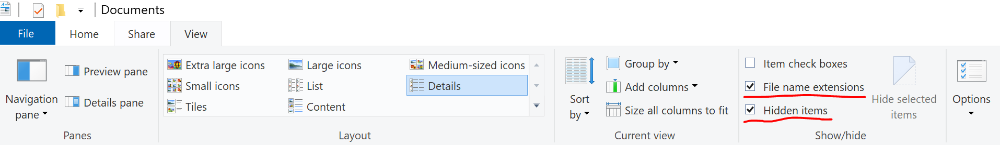

# Windows Filesystem & Windows Explorer

You may be familiar with other file systems, or way to navigate around your computer. You may not.

Suffice to say, knowing how to navigate round your computer using the GUI is going to be vital. We'll also be using the command line or terminal a lot, but to help understand what's going on there sometimes it's easier to start with how you do things with the mouse and the UI.

## Folders

Imagine your computer is like a gigantic filing cabinet, with folders instead of drawers. Each folder is like a labeled section where you can store different types of documents or files. Now, this filing cabinet has a main folder called the "root" folder. It's like the top-level boss of all the folders.

Inside the root folder, you've got your basic folders, like "Documents," "Pictures," "Music," and so on. These are like the main categories in your filing cabinet.

Inside the "Documents" folder, you might have more folders, each with their own specific purpose. For example, you could have folders for work, personal projects, or assignments. These are like subcategories within the main category.

And guess what? You can keep going deeper! Let's say you open up the "Work" folder. Inside, you might have even more folders, organized by project or department. It's like a never-ending nesting doll of folders within folders.

## Files

Each of these folders can hold files – like documents, photos, spreadsheets, you name it. These files are like the papers inside your folders. You can create, edit, move, and delete files just like you would with physical documents.

And just like in real life, you can use Windows Explorer to navigate through this digital filing cabinet. It's like having a map to guide you through the maze of folders and files on your computer. You can open, copy, move, and delete files with just a few clicks.

### File Extensions


File extensions are like little tags at the end of a file name that tell your computer what type of file it is and which program should be used to open it. 

For example, if you see a file named ```document.docx,``` the ```.docx``` part is the file extension, and it tells your computer that this is a Microsoft Word document. Similarly, a file named ```photo.jpg``` has the ```.jpg``` extension, indicating that it's a JPEG image file.

These extensions are important because they help the computer figure out how to handle each file. When you double-click on a file, the computer looks at its extension to determine which program to use to open it. For example, if you double-click on a file with a ```.txt``` extension, your computer knows to open it with a text editor like Notepad or WordPad.

In addition to indicating file types, file extensions can sometimes give you clues about the contents of a file. For example, ".exe" extensions typically indicate executable programs, while ".mp3" extensions indicate audio files.

### Enabling File Extension in Windows Explorer

By default, Windows doesn't show you the file extensions by default, or hidden files or folders. We'lll need to be abel to see these.

In Windows Explorer, on the top ribbon click the View tab and ensure *File name extensions* and *Hidden items* checkboxes are both checked:



***

:thought_balloon: Wrapping Up

The Windows filesystem is like a virtual filing system, with folders acting as containers for organizing your digital "stuff". It's all about keeping your files neat, tidy, and easy to find.

## Common Actions

### Creating Files:
1. **Right-click Method**:
   - Right-click on an empty space within the folder where you want to create the file.
   - From the context menu, hover over "New."
   - Select the type of file you want to create (e.g., "Text Document" for a new text file).
   - A new file with a default name will be created, ready for you to rename and edit.

2. **Keyboard Shortcut**:
   - While in the folder where you want to create the file, press the `Ctrl` + `N` keys simultaneously.
   - This action will typically create a new untitled file of the default type for that folder, such as a new text document.

### Renaming Files:
1. **Right-click Method**:
   - Right-click on the file you want to rename.
   - Select "Rename" from the context menu.
   - Type in the new name and press `Enter` to save the changes.

2. **Single-click Method**:
   - Single-click on the file you want to rename to select it.
   - Wait a moment, then click on the file name again (not the icon).
   - This will allow you to edit the file name directly in place. Once you've typed the new name, press `Enter` to save the changes.

### Deleting Files:
1. **Right-click Method**:
   - Right-click on the file you want to delete.
   - Select "Delete" from the context menu.
   - Confirm the deletion when prompted.

2. **Keyboard Shortcut**:
   - Select the file you want to delete.
   - Press the `Delete` key on your keyboard.
   - Confirm the deletion when prompted.

### Moving Files:
1. **Drag and Drop Method**:
   - Open the folder containing the file you want to move.
   - Click and hold the file you want to move, then drag it to the destination folder.
   - Release the mouse button to drop the file into the new folder.

2. **Cut and Paste Method**:
   - Select the file you want to move.
   - Right-click on the selected file and choose "Cut" from the context menu.
   - Navigate to the destination folder.
   - Right-click in the destination folder and choose "Paste" from the context menu to move the file.
